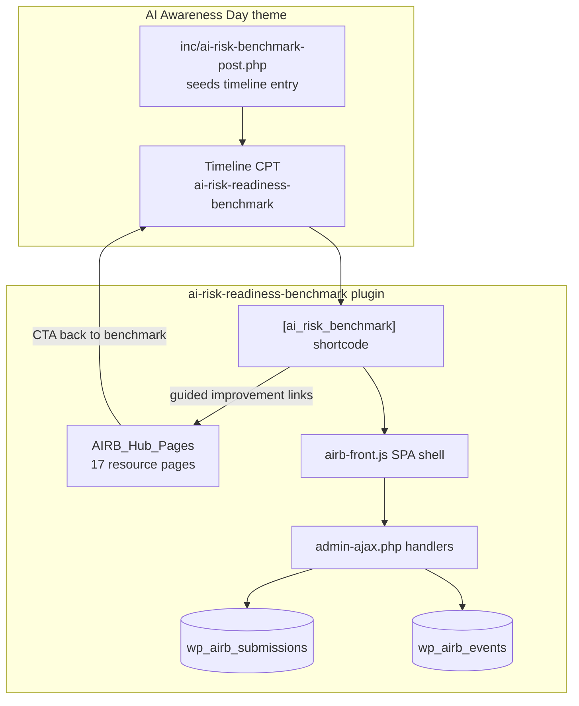
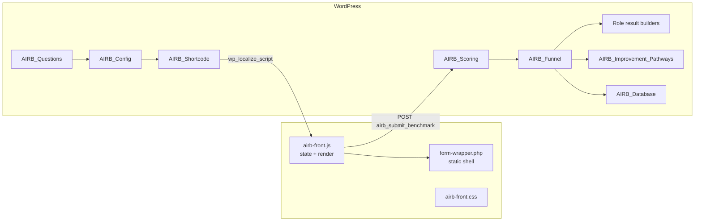
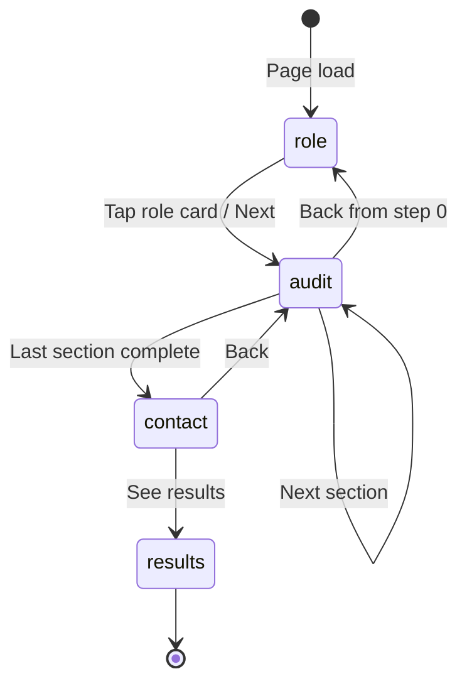
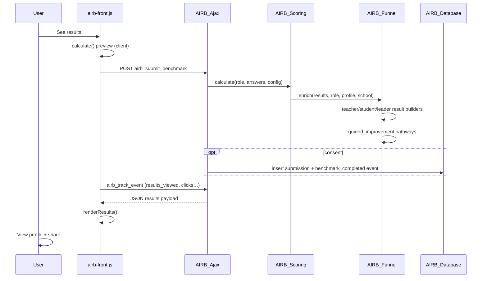
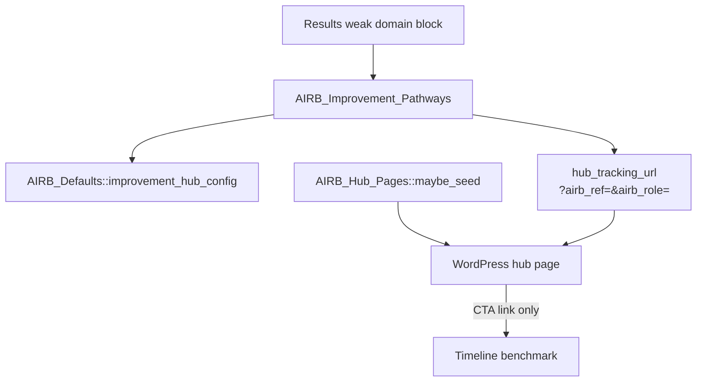
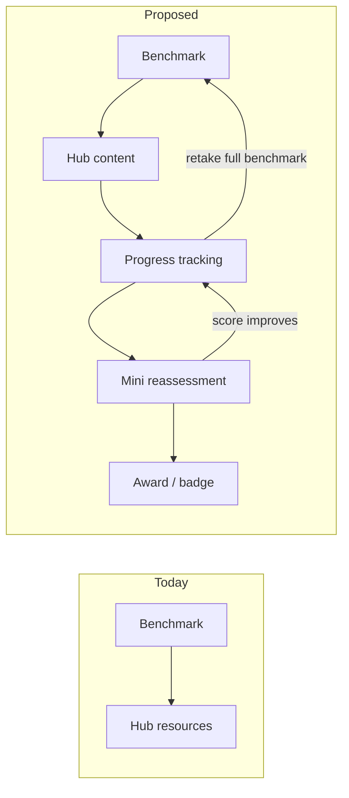
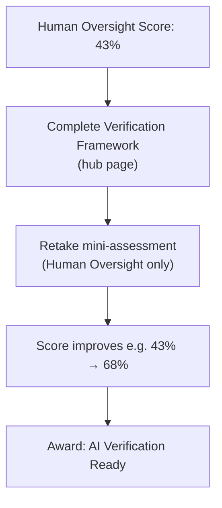
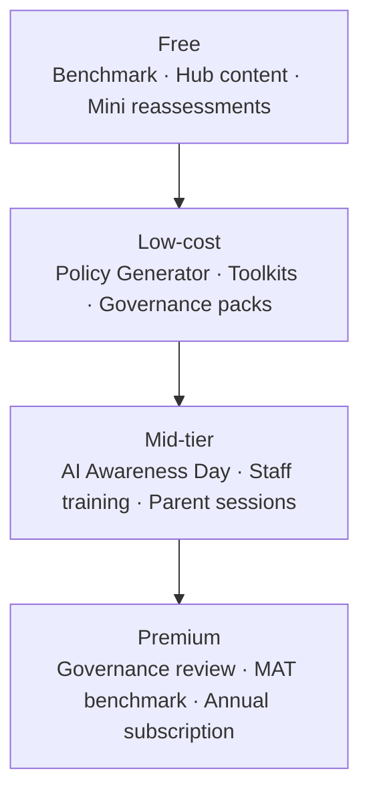

# AI Risk & Readiness Benchmark — Architecture & Flow

This document describes how the **AI Risk & Readiness Benchmark™** is structured in the AI Awareness Day WordPress site: plugin layout, user journey, scoring pipeline, how results connect to improvement resources, and the proposed **Readiness Journey** layer that turns the audit into a defensible benchmarking platform.

**Companion doc (content verification):** [`benchmark-resource-hub-content.md`](benchmark-resource-hub-content.md) — full export of hub pages for fact-checking.  
**Content strategy:** [`benchmark-content-strategy.md`](benchmark-content-strategy.md) — intervention frameworks, 30-day priorities, Policy Generator spec.

**Plugin:** `plugins/ai-risk-readiness-benchmark/`  
**Current version:** `1.17.0`  
**Primary shortcode:** `[ai_risk_benchmark]`  
**School dashboard shortcode:** `[ai_risk_school_dashboard]`

---

## 1. Purpose

The benchmark is a DfE-aligned, multi-audience assessment for UK schools. It measures **behavioural AI exposure and readiness** across four roles:

| Role | Slug | Audience |
|------|------|----------|
| Teacher | `teacher` | Classroom staff |
| Student | `student` | Pupils |
| Parent / carer | `parent` | Home context |
| School leader | `leader` | SLT / governance |

Signature metrics include **Human Oversight Ratio™**, **AI Dependency Index™**, domain readiness scores, and an overall **DfE alignment / readiness** score.

---

## 2. Where it lives on the site



| Surface | Purpose |
|---------|---------|
| **Timeline entry** (`/timeline/ai-risk-readiness-benchmark/`) | Launch article + embedded interactive benchmark (canonical entry point) |
| **Any page/post** with `[ai_risk_benchmark]` | Same tool, e.g. standalone `/ai-risk-benchmark/` page |
| **Resource hub pages** (17 pages — see §9) | Level 2 improvement content linked from weak-score results; **part of the AIRB plugin ecosystem**, not embedded in the SPA |
| **School dashboard** (`[ai_risk_school_dashboard]`) | Aggregated view when a school name + consented submissions exist |

The theme bundles the plugin via `inc/bundled-plugins.php` and seeds the timeline post in `inc/ai-risk-benchmark-post.php`.

---

## 3. High-level architecture



### Layer responsibilities

| Layer | Responsibility |
|-------|------------------|
| **Presentation** (`templates/form-wrapper.php`, CSS) | App shell: hero, deck carousel, screen containers, nav slot |
| **Client app** (`public/js/airb-front.js`) | Single-page flow: role → audit → contact → results |
| **Config** (`AIRB_Config`, `AIRB_Defaults`) | Questions, copy, domains, hub URLs, role-specific result config |
| **Scoring** (`AIRB_Scoring`) | Turn raw answers into scores, bands, recommendations |
| **Funnel** (`AIRB_Funnel`) | Enrich scores with role results, improvement blocks, legacy gateway |
| **Persistence** (`AIRB_Database`) | Store consented submissions; `session_id`, `contact_opt_in` |
| **Events** (`AIRB_Events`, `airb_track_event`) | Anonymous journey log: clicks, results viewed, benchmark completed |
| **Hub** (`AIRB_Hub_Pages`, improvement pathways) | WordPress resource pages with `?airb_ref=&airb_role=` tracking params |
| **Readiness Journey** *(proposed)* | Progress tracking, mini reassessments, badges, school/national roll-ups |

---

## 4. User flow (client state machine)

The front end is a **phase-based SPA** inside `#airb-benchmark`. State is held in a single `state` object in `airb-front.js`.



### Phases and screens

| Phase | DOM container | What happens |
|-------|---------------|--------------|
| `role` | `#airb-screen-role` | User picks Teacher / Student / Parent / Leader |
| `audit` | `#airb-screen-audit` | Section-by-section questions with progress stepper |
| `contact` | `#airb-screen-contact` | Optional profile fields (role shown read-only) |
| `results` | `#airb-screen-results` | Scored profile, role narrative, improvement links, share |

### Navigation

- **Role screen:** Tapping a role card calls `beginAudit()` directly (no separate Next on mobile).
- **Audit / contact:** `#airb-nav` (Back / Next or See results).
- **Mobile (≤768px):** Nav and error toast move inline under the active screen (`syncNavPlacement()`); timeline chrome uses `airb--mobile-flow`.

### Local persistence

- `localStorage` key `airb_completed_roles_v1` tracks which roles this device has finished (completion pills on role cards).

---

## 5. Audit structure

Questions are defined in PHP (`AIRB_Questions::all()`) and exposed to JS via `AIRB_Config::public_config()` grouped into **sections per role**.

Each question has:

- `id`, `role`, `domain`, `section` (display grouping)
- `type`: `radio`, `slider`, etc.
- `options` with `score` values used by the scoring engine

Domains (shared framework):

- Safe Adoption  
- Human Oversight  
- AI Dependency  
- Privacy & Data Protection  
- Safeguarding  
- Assessment Integrity  
- AI Literacy  
- Governance (leader-weighted)

The client builds `state.sections` and `state.questions` from config when a role is selected (`sectionsForRole()`).

---

## 6. Contact step (by role)

| Role | Fields |
|------|--------|
| **Teacher / Leader** | Your role (read-only), optional school name, school phase, org type, optional email |
| **Student / Parent** | Your role (read-only), optional year group, consent checkboxes |

**Consent (contact step):**

- **Store anonymously** — opt-in checkbox; when checked, submission is persisted to `wp_airb_submissions` and contributes to national benchmarks.
- **Contact about support** — optional (staff roles); requires email if checked.

Session ID (`airb_session_id_v1` in `localStorage`) links submissions to post-results events.

---

## 7. Submission & scoring pipeline



### Server handler (`AIRB_Ajax::submit`)

1. Verify nonce  
2. Sanitize role, answers, school, email, profile  
3. **`AIRB_Scoring::calculate()`** — domain scores, alignment, risk %, dependency, human oversight  
4. **`AIRB_Funnel::enrich()`** — role-specific payloads, heatmap, guided improvement  
5. **`AIRB_Pathway::build_gateway()`** — legacy product cards (suppressed for role-specific flows)  
6. Optional **`AIRB_Database::insert()`** if consent  
7. Return full `results` object to client  

### Key computed fields

| Field | Meaning |
|-------|---------|
| `alignment_score` | Overall readiness / DfE alignment (0–100) |
| `overall_risk_percentage` | Inverse exposure view |
| `dependency_index` | AI reliance (teacher/student/leader) |
| `human_oversight_ratio` / `human_oversight_readiness` | Oversight gauge input |
| `domain_scores` | Per-domain readiness and risk |
| `readiness_level_label` / `risk_level_label` | Band labels (Strong, Established, etc.) |

---

## 8. Results screen composition

Rendering is split between **`resultsProfileHtml()`** (shared profile block) and role-specific HTML builders.

### Profile block (all roles with full audit)

Order for **teacher / student**:

1. Eyebrow + title + readiness band  
2. **Human Oversight Ratio™** gauge  
3. Three score rows (Readiness, AI Risk, Dependency) — compact 3-row panel  
4. Domain breakdown (bar rows)  
5. **Teacher only:** Benchmark summary metrics table  

### Role-specific sections (`teacherResultsHtml`, etc.)

**Teacher** (`AIRB_Teacher_Results`):

- Performance headline  
- Strengths (3 cards)  
- Opportunities (weak domains, card layout)  
- Champion or gap pathway  
- Suggested resources (if champion)  

**Student** (`AIRB_Student_Results`):

- Learning profile metrics  
- Strengths / opportunities / learning challenge  
- Student resources  

**Leader** (`AIRB_Leader_Results`):

- Executive summary  
- Governance maturity  
- Peer benchmark  
- Priority focus areas  
- Risk heatmap  
- Next steps / whole-school rollout  

**Parent** (profile-focused):

- Parent band summary, domain scores, focus topics, exposure list  

### Shared tail (all roles)

- **Guided improvement** (`AIRB_Improvement_Pathways`) — weak pillars → hub page links  
- **Share hint + Share results with your school** (mailto, role-specific copy)  
- **Staff only:** optional Request full leadership report (if theme contact email set)  
- **Email me this summary** (if user provided email)  
- **View school dashboard** link (if school name provided)

---

## 9. Improvement hub (Level 2)

The **resource hub is part of the AI Risk Benchmark block architecture** — not a separate product. It is seeded and configured entirely inside the `ai-risk-readiness-benchmark` plugin. Hub pages are WordPress `page` posts; the benchmark itself is a shortcode SPA. They connect bidirectionally: results → hub (with tracking params), hub → timeline benchmark (CTA).



### Resource hub registry (17 pages)

| Hub | Slug | Audience |
|-----|------|----------|
| Teacher AI Verification Framework | `teacher-ai-verification-framework` | teacher |
| AI Lesson Planning Checklist | `teacher-ai-lesson-planning-checklist` | teacher |
| Teacher AI Privacy Guide | `teacher-ai-privacy-guide` | teacher |
| Teacher AI Assessment Guide | `teacher-ai-assessment-guide` | teacher |
| Student AI Study Skills | `student-ai-study-skills` | student |
| Think First, Prompt Second | `think-first-prompt-second` | student |
| Student AI Privacy Guide | `student-ai-privacy-guide` | student |
| How To Check AI Answers | `how-to-check-ai-answers` | student |
| Parent AI Safety Guide | `parent-ai-safety` | parent |
| Parent AI Homework Guide | `parent-ai-homework-guide` | parent |
| Parent Deepfake Awareness | `parent-deepfake-awareness` | parent |
| Talking To Children About AI | `talking-to-children-about-ai` | parent |
| AI Policy Generator | `ai-policy-generator` | leader |
| School AI Governance | `school-ai-governance` | leader |
| DfE AI Compliance Checklist | `dfe-ai-compliance-checklist` | leader |
| AI Risk Register | `ai-risk-register` | leader |
| AI Awareness Day | `ai-awareness-day` | all |
| Annual AI Benchmark Review | `annual-benchmark-review` | leader |
| AI Champion Programme | `ai-champion-programme` | teacher |
| School AI Maturity Framework | `school-ai-maturity` | leader |
| UK School AI Benchmark Report | `national-benchmark-report` | all |

**Full page copy + benchmark→hub mapping:** [`benchmark-resource-hub-content.md`](benchmark-resource-hub-content.md)  
**Content priorities + framework spec:** [`benchmark-content-strategy.md`](benchmark-content-strategy.md)

### Implementation notes

- **`AIRB_Hub_Pages`** seeds resource pages once per site (`class-airb-hub-pages.php`).  
- Hub pages contain **article content + link back** to the timeline benchmark (`AIRB_Defaults::benchmark_page_url()`). They do **not** embed `[ai_risk_benchmark]`.  
- Improvement blocks surface up to **4** weakest pillars per role with Read / Watch / Download / Join links.  
- **Content status (v1.17.0):** Hub pages use the **intervention framework** template (Why / What / Download / Training / Retake). Six pages have full exemplar copy (`AIRB_Hub_Content`); remainder use scaffold until editorial pass. PDFs and Policy Generator shortcode still required. See [`benchmark-content-strategy.md`](benchmark-content-strategy.md).  
- **Not in AIRB hub:** `national-survey-2026` (`[aiad_national_survey]`) — separate theme feature.

---

## 10. Readiness Journey (Level 3 — proposed)

The current architecture delivers **diagnosis → interventions**. The next strategic layer is **progression → evidence**.

See [`benchmark-content-strategy.md`](benchmark-content-strategy.md) for maturity bands, champion levels, and 60-day build order.

### Progression models (specified — unlock logic TBC)

**Teacher — AI Champion Programme (L1–L5):** AI Aware → Verification Ready → Responsible AI Practitioner → AI Champion → School AI Lead. Hub: `ai-champion-programme`.

**Leader — School Maturity Framework:** Emerging (0–25) → Developing (26–50) → Established (51–75) → Leading (76–100). Each band maps to priority interventions. Hub: `school-ai-maturity`.

**National — UK School AI Benchmark Report 2027:** Aggregated consented data by phase and trust type. Hub: `national-benchmark-report`.

### Current vs proposed



| Stage | What the user gets | What the platform needs |
|-------|--------------------|-------------------------|
| **Benchmark** | Scores, weak domains, heat map | Persist submission + session |
| **Resources** | Frameworks, checklists, guides | Track which links were opened |
| **Progress tracking** | “You started Verification Framework” | Journey events + completion state |
| **Mini reassessment** | Short re-check on one pillar | Subset question bank + prior baseline |
| **Award** | e.g. **AI Verification Ready** | Threshold rules + shareable credential |

### Example: Teacher — Human Oversight



This introduces **progression** and gives schools **evidence of development** — not just a one-off score, but a documented improvement arc tied to specific content pillars.

### Design principles

- **Pillar-scoped mini assessments** — reuse existing domain/question bank; do not require a full re-audit for every improvement step.
- **Baseline + delta** — store first benchmark score, then measure change after resource completion and mini reassessment.
- **School-visible evidence** — leader dashboard shows which staff/parents/students completed pillars and earned badges (with consent).
- **Annual loop** — full benchmark retake each year; mini reassessments in between for active improvement.

### Planned data (not yet built)

| Entity | Purpose |
|--------|---------|
| `airb_sessions` | Anonymous or identified journey key across visits |
| `airb_events` | `resource_completed`, `mini_assessment_started`, `badge_awarded`, etc. |
| `airb_progress` | Per role + pillar: baseline score, current score, status |
| `airb_badges` | Award definitions, thresholds, earned timestamps |

---

## 11. Commercial model

The architecture supports a tiered funnel without changing the free benchmark core.



| Tier | Offer | Role in funnel |
|------|-------|----------------|
| **Free** | Benchmark, hub content, mini reassessments, badges | Lead generation + trust + evidence of improvement |
| **Low-cost** | Policy Generator, toolkits, governance packs | Self-serve conversion after weak governance/privacy scores |
| **Mid-tier** | AI Awareness Day, staff training, parent sessions | Whole-school activation after leader benchmark |
| **Premium** | Governance review, MAT benchmark, annual school subscription | Recurring revenue + defensible benchmarking data |

The strongest commercial path is not “buy our course” but:

**Benchmark → weakness → free resource → measurable improvement → toolkit → consultation → training → annual reassessment**

---

## 12. Platform evolution — next phase

The architecture is **already strong enough** to support this vision. The benchmark UI, scoring engine, role-specific results, improvement pathways, and hub pages are in place.

**The next phase should not be adding more questions or more content.**

It should be:

| Priority | Outcome |
|----------|---------|
| **1. Persist data** | Fix consent + store every completion (anonymised by default); restore school dashboard and national stats |
| **2. Track behaviour after results** | Event log: guided-link clicks, hub visits, share, consultation CTAs |
| **3. Measure improvement over time** | Baseline vs mini reassessment vs annual retake; pillar-level deltas |
| **4. Build school and national benchmarking** | Consented roll-ups, peer comparison, MAT views, live national sample |

That is the point where the **AI Risk & Readiness Benchmark** stops being an assessment tool and becomes a **defensible benchmarking platform**.

### Implemented (v1.16.0)

| Feature | Location |
|---------|----------|
| Consent checkboxes on contact | `airb-front.js` → `consentFieldsHtml()` |
| `airb_track_event` AJAX | `AIRB_Ajax::track_event`, `AIRB_Events` |
| Hub URL params | `AIRB_Defaults::hub_tracking_url` → `?airb_ref=&airb_role=` (+ `airb_session` client-side) |
| Admin funnel view | **AI Risk Benchmark → Funnel & events** |

### Remaining (Readiness Journey)

| Gap | Next step |
|-----|-----------|
| No mini-assessment or badge layer | Pillar-scoped re-checks + awards (§10) |
| Hub page visit attribution server-side | Log `airb_ref` on hub page load via theme hook |
| Cross-device journey | Tie session to school login or magic link |
| Improvement over time | Baseline vs retake deltas in `airb_progress` |

---

## 13. Data model

**Table:** `{prefix}airb_submissions` (see `AIRB_Database::create_table`)

| Column | Notes |
|--------|-------|
| `session_id`, `role`, `school_name`, `email` | Identity / session |
| `consent`, `contact_opt_in` | Benchmark storage + follow-up opt-in |
| `alignment_score`, `dependency_index`, … | Top-level metrics |
| `domain_scores`, `answers`, `recommendations` | JSON longtext |
| `created_at` | Timestamp |

**Table:** `{prefix}airb_events` (see `AIRB_Events::create_table`)

| Column | Notes |
|--------|-------|
| `session_id`, `submission_id` | Link journey to stored submission |
| `event_type` | e.g. `guided_resource_click`, `share_click`, `consultation_click` |
| `role`, `metadata` (JSON), `created_at` | Event payload |

**School dashboard** aggregates consented rows by normalized school name and role counts.

**Future (Readiness Journey):** extend with `airb_progress` and `airb_badges` — see §10.

---

## 14. Admin & exports

**`AIRB_Admin`** (wp-admin):

- Settings (config overrides, contact funnels)  
- Submissions list  
- CSV export  
- School dashboard preview  

---

## 15. Asset & config injection

On shortcode render, `AIRB_Shortcode::enqueue_assets()` loads:

- `public/css/airb-front.css`  
- `public/js/airb-front.js`  
- `public/js/airb-deck.js` (intro carousel)

`wp_localize_script( 'airb-front', 'airbBenchmark', … )` provides:

- `ajaxurl`, `nonce`, `contactEmail`  
- `config` — questions, sections, domains, role result copy, improvement hub  
- `i18n` — all UI strings  

---

## 16. Key files reference

| File | Role |
|------|------|
| `ai-risk-readiness-benchmark.php` | Plugin bootstrap |
| `templates/form-wrapper.php` | HTML shell and intro deck |
| `public/js/airb-front.js` | Client app: flow, render, AJAX |
| `public/css/airb-front.css` | Layout, mobile flow, results UI |
| `includes/class-airb-questions.php` | Question bank |
| `includes/class-airb-scoring.php` | Scoring engine |
| `includes/class-airb-funnel.php` | Results enrichment router |
| `includes/class-airb-teacher-results.php` | Teacher narrative builder |
| `includes/class-airb-student-results.php` | Student narrative builder |
| `includes/class-airb-leader-results.php` | Leader narrative builder |
| `includes/class-airb-improvement-pathways.php` | Hub link blocks |
| `includes/class-airb-defaults.php` | Default copy, hub definitions, domains |
| `includes/class-airb-ajax.php` | Submit + email endpoints |
| `includes/class-airb-events.php` | Journey event log + funnel aggregates |
| `includes/class-airb-database.php` | Submissions table |
| `admin/views/funnel.php` | Admin funnel dashboard |
| `includes/class-airb-hub-pages.php` | One-time hub page seeding |
| `benchmark-resource-hub-content.md` | Full hub page export for content verification |
| `inc/ai-risk-benchmark-post.php` | Theme timeline seed |

---

## 17. Prototype reference

`Benchmark.jsx` at the repo root is an early React prototype of the same flow (role → audit → contact → results). The production implementation is the WordPress plugin above; behaviour and copy have diverged (role-specific results, mobile shell, improvement hub, universal share).

---

## 18. Local development

```bash
docker compose up -d
# WordPress: http://localhost:8888
# Benchmark timeline: post slug ai-risk-readiness-benchmark (ID may vary)
```

The plugin directory is mounted into `wp-content/plugins/ai-risk-readiness-benchmark`. Hard-refresh after changes; version is busted via `AIRB_VERSION`.
