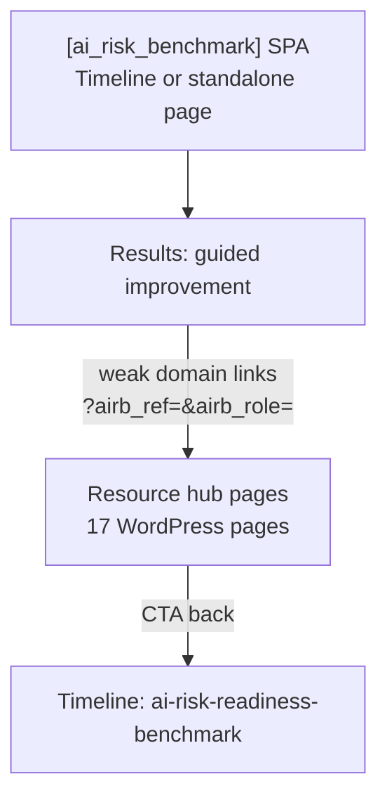

# AI Risk Benchmark — Resource Hub Content (verification export)

> **Purpose:** Full export of WordPress pages linked from the AI Risk & Readiness Benchmark™ for independent fact-checking, content expansion, and DfE/ICO alignment review.
>
> **Generated:** 2026-06-14 from local Docker WordPress (`localhost:8888`)
>
> **Related:** [`benchmark-architecture.md`](benchmark-architecture.md) · [`benchmark-content-strategy.md`](benchmark-content-strategy.md)  
> **Note:** Re-export after v1.17.0 intervention upgrade — pages may no longer be PLACEHOLDER.

---

## 1. How these pages relate to the benchmark block

| Layer | What it is | Shortcode / location |
|-------|------------|----------------------|
| **Level 1 — Benchmark** | Interactive audit | `[ai_risk_benchmark]` on timeline post `/timeline/ai-risk-readiness-benchmark/` |
| **Level 2 — Resource hub** | Improvement articles | 17 pages seeded by `AIRB_Hub_Pages` — **do not** embed the benchmark |
| **School roll-up** | Whole-school view | `[ai_risk_school_dashboard]` on timeline launch article |
| **Separate** | National Survey 2026 | `[aiad_national_survey]` on `/national-survey-2026/` — **not** part of AIRB hub |

**Source of truth for hub definitions:** `plugins/ai-risk-readiness-benchmark/includes/class-airb-defaults.php` → `hub_page_definitions()`, `improvement_hub_config()`.

---

## 2. Content status (important for verifiers)

| Status | Meaning |
|--------|---------|
| **PLACEHOLDER** | Seeded template only — excerpt + generic “What you'll find here” list. **Substantive frameworks, checklists and downloads are not yet written on-page.** |
| **LIVE TOOL** | Page embeds a shortcode (benchmark or survey), not article content |
| **LAUNCH ARTICLE** | Full editorial content on timeline entry |

**Action for content team:** Each PLACEHOLDER page needs expanded body copy, downloadable assets, and DfE/ICO/KCSIE citations before public launch as “verification-ready” resources.

---

## 3. Resource hub registry (17 pages)

| Slug | Title | Audience | URL path | Status |
|------|-------|----------|----------|--------|

| `teacher-ai-verification-framework` | Teacher AI Verification Framework | teacher | `/teacher-ai-verification-framework/` | PLACEHOLDER |
| `teacher-ai-lesson-planning-checklist` | AI Lesson Planning Checklist | teacher | `/teacher-ai-lesson-planning-checklist/` | PLACEHOLDER |
| `teacher-ai-privacy-guide` | Teacher AI Privacy Guide | teacher | `/teacher-ai-privacy-guide/` | PLACEHOLDER |
| `teacher-ai-assessment-guide` | Teacher AI Assessment Guide | teacher | `/teacher-ai-assessment-guide/` | PLACEHOLDER |
| `student-ai-study-skills` | Student AI Study Skills | student | `/student-ai-study-skills/` | PLACEHOLDER |
| `think-first-prompt-second` | Think First, Prompt Second | student | `/think-first-prompt-second/` | PLACEHOLDER |
| `student-ai-privacy-guide` | Student AI Privacy Guide | student | `/student-ai-privacy-guide/` | PLACEHOLDER |
| `how-to-check-ai-answers` | How To Check AI Answers | student | `/how-to-check-ai-answers/` | PLACEHOLDER |
| `parent-ai-safety` | Parent AI Safety Guide | parent | `/parent-ai-safety/` | PLACEHOLDER |
| `parent-ai-homework-guide` | Parent AI Homework Guide | parent | `/parent-ai-homework-guide/` | PLACEHOLDER |
| `parent-deepfake-awareness` | Parent Deepfake Awareness | parent | `/parent-deepfake-awareness/` | PLACEHOLDER |
| `talking-to-children-about-ai` | Talking To Children About AI | parent | `/talking-to-children-about-ai/` | PLACEHOLDER |
| `ai-policy-generator` | AI Policy Generator | leader | `/ai-policy-generator/` | PLACEHOLDER |
| `school-ai-governance` | School AI Governance | leader | `/school-ai-governance/` | PLACEHOLDER |
| `dfe-ai-compliance-checklist` | DfE AI Compliance Checklist | leader | `/dfe-ai-compliance-checklist/` | PLACEHOLDER |
| `ai-risk-register` | AI Risk Register | leader | `/ai-risk-register/` | PLACEHOLDER |
| `ai-awareness-day` | AI Awareness Day | all | `/ai-awareness-day/` | PLACEHOLDER |

| `ai-risk-benchmark` | AI Risk & Readiness Benchmark | all | `/ai-risk-benchmark/` | LIVE TOOL (`[ai_risk_benchmark]`) |
| `national-survey-2026` | National Survey 2026 | all | `/national-survey-2026/` | LIVE TOOL (`[aiad_national_survey]`) — separate product |

---

## 4. Benchmark results → hub mapping

When a user scores below threshold on a domain, `AIRB_Improvement_Pathways` surfaces these links in **Learn how to improve this score**:

| Role | Weak metric / domain | Resource label | Kind | Hub slug |
|------|----------------------|----------------|------|----------|
| Teacher | Human Oversight Score | Verify Before You Trust Framework | read | teacher-ai-verification-framework |
| Teacher | Human Oversight Score | 10-minute Teacher Verification Masterclass | watch | teacher-ai-verification-framework |
| Teacher | Human Oversight Score | AI Lesson Planning Checklist | download | teacher-ai-lesson-planning-checklist |
| Teacher | Human Oversight Score | AI Awareness Day Teacher Session | join | ai-awareness-day |
| Teacher | Privacy & Data Protection | Teacher AI Privacy Guide | read | teacher-ai-privacy-guide |
| Teacher | Privacy & Data Protection | Pupil Data Reminder Card | download | teacher-ai-privacy-guide |
| Teacher | AI Literacy Score | DfE AI Guidance Briefing | read | teacher-ai-assessment-guide |
| Teacher | Assessment Awareness | Teacher AI Assessment Guide | read | teacher-ai-assessment-guide |
| Teacher | AI Dependency Index™ | Verify Before You Trust Framework | read | teacher-ai-verification-framework |
| Student | Verification Skills | How To Check AI Answers | read | how-to-check-ai-answers |
| Student | Privacy Awareness | Student AI Privacy Guide | read | student-ai-privacy-guide |
| Student | Independent Thinking | Think First, Prompt Second Guide | read | think-first-prompt-second |
| Student | AI Dependency Score | Think First, Prompt Second Guide | read | think-first-prompt-second |
| Student | AI Dependency Score | Student AI Study Skills Challenge | join | student-ai-study-skills |
| Student | AI Dependency Score | How To Spot When AI Is Wrong | read | how-to-check-ai-answers |
| Parent | Home AI Safety Score | Parent AI Safety Guide | read | parent-ai-safety |
| Parent | Home AI Safety Score | Questions To Ask Your Child About AI | read | talking-to-children-about-ai |
| Parent | Home AI Safety Score | Deepfake Awareness Briefing | read | parent-deepfake-awareness |
| Parent | Homework Support Risk | Parent AI Homework Guide | read | parent-ai-homework-guide |
| Leader | Governance Score | AI Policy Generator | read | ai-policy-generator |
| Leader | Governance Score | Governance Checklist | download | school-ai-governance |
| Leader | Governance Score | Leadership Toolkit | read | school-ai-governance |
| Leader | Staff Verification Readiness | Teacher Verification Framework | read | teacher-ai-verification-framework |
| Leader | Safeguarding Readiness | Safeguarding & AI Briefing | read | school-ai-governance |
| Leader | Assessment Integrity | JCQ-Aligned Assessment Review Guide | read | teacher-ai-assessment-guide |
| Leader | Assessment Integrity | DfE AI Compliance Checklist | download | dfe-ai-compliance-checklist |
| Leader | Data Protection Readiness | DPIA / Data Protection Checklist | download | dfe-ai-compliance-checklist |
| Leader | Data Protection Readiness | AI Risk Register Template | read | ai-risk-register |

---

## 5. Timeline launch article (embeds benchmark)

**Post type:** `timeline`  
**Slug:** `ai-risk-readiness-benchmark`  
**Title:** The Hidden Threat in School AI Adoption: It's Not the Tech, It's the Dependency  
**URL:** `/timeline/ai-risk-readiness-benchmark/`

**Embeds:** `[ai_risk_school_dashboard]` + `[ai_risk_benchmark]`

### Article body (live WordPress content)

Every school leader is currently being flooded with AI guidance. Regulators like the DfE, ICO, KCSIE, JCQ and Ofqual have made it clear: schools must adopt AI safely. In response, schools are rushing to roll out AI policies and staff training.

But as leadership teams tick these compliance boxes, a critical question remains unanswered: **do you actually know how AI is changing human behaviour in your school community?**

Most existing AI audits only measure *adoption* — whether you have the tech, the policies and the infrastructure. They completely miss *exposure* — how dependent your teachers and students are becoming on these tools, and where your actual risks lie.

## The blind spots in standard AI audits

Traditional readiness frameworks focus heavily on technology and paperwork. They ask questions like “Do you have an AI policy?” or “Do you provide AI training?” While those are important compliance steps, they create a false sense of security. They don’t address the real, day-to-day risks across your entire school community:

- **Teachers:** Are they entering sensitive pupil data into unapproved tools? Are they blindly trusting AI-generated lesson plans without verifying the outputs?
- **Students:** Is AI assisting their homework, or is it completely replacing critical thinking? Could they still complete the work without it?
- **Parents:** Do they understand how their children use AI at home? Are they aware of deepfakes, algorithmic bias and privacy risks?
- **Leaders:** Do you have a clear, data-driven view of your compliance with DfE, ICO and KCSIE guidelines?

If you only measure technology adoption, you are blind to behavioural risk.

## Shifting from “AI readiness” to “AI dependency”

To safely navigate the AI era, schools need to measure human behaviour, not just software deployment. The core issue isn’t whether your school allows AI, but how exposed it is to the risks of that AI.

| Traditional AI audits | The behavioural risk approach |
| Do you have an AI policy? | Do staff actually follow it? |
| Do you provide training? | Has training reduced risky behaviour? |
| Do you allow AI tools? | How dependent are people becoming on them? |
| Are safeguards documented? | Are people actively bypassing safeguards? |
| Is governance in place? | Where is data exposure actually occurring? |

By focusing on behavioural risk, leaders can identify exactly where confidence outpaces competence — and target interventions where they are needed most.

## Introducing the AI Risk & Readiness Benchmark™

To help schools bridge this data gap, we have launched the **AI Risk & Readiness Benchmark™** — and it is completely free for UK schools. This is the UK’s first DfE-aligned assessment platform built specifically to measure AI dependency, risk and governance maturity across your entire school community.

- **Teacher Benchmark** — reliance, data entry, verification
- **Student Benchmark** — critical thinking, prompt literacy
- **Parent Benchmark** — safety awareness, home usage
- **Leader Benchmark** — compliance, governance, policy

Instead of a generic checklist, the platform gathers anonymous insights from teachers, students, parents and leaders to generate two unique data points for your school:

- **The AI Dependency Index™** — measures reliance, human oversight, verification habits and privacy behaviours across all four audiences.
- **The DfE Alignment Score** — a clear picture of your compliance standing against current DfE, ICO, KCSIE, JCQ and Ofqual guidance.

## The school-wide dashboard

Individual audits are useful — but the real power comes when teachers, students, parents and leaders have all taken part. Results are aggregated into a single whole-school picture, so leadership can see exactly where confidence outpaces competence. Here is what that looks like for an example school:

- **Teachers:** 71%
- **Students:** 58%
- **Parents:** 49%
- **Leadership:** 82%

**Overall DfE AI Alignment Score: 65%**  ·  **Risk level: Medium–High**

**Key exposure areas:** Teacher Dependency · Output Verification · Governance Maturity

| Risk area | Score |
| Dependency | High |
| Oversight | Medium |
| Governance | Low |
| Privacy | Low |
| Safeguarding | Medium |

Once your school has completed audits across all four groups, your live dashboard appears here:

[ai_risk_school_dashboard]

## The killer metric: the Human Oversight Ratio™

If you measured only one thing, measure this. The Human Oversight Ratio™ asks a single, revealing question: *what percentage of AI-generated output do you modify before using it?* It is the clearest signal of whether AI is a tool people think with — or a shortcut they think instead of.

| Modified before use | What it means |
| 0–10% | Critical reliance |
| 11–25% | High reliance |
| 26–50% | Moderate oversight |
| 51%+ | Strong oversight |

## Audit yourself or your school for free

Don’t wait for a compliance failure or a safeguarding incident to find out where your risks are. Move beyond basic adoption checklists and discover your actual AI exposure — teachers, students, parents and leaders can all start the benchmark below.

[ai_risk_benchmark]

---

## 6. Hub page content (live WordPress)

Below is the **full published body** for each resource hub page as of export date.

### Teacher AI Verification Framework

- **Slug:** `teacher-ai-verification-framework`
- **Status:** PLACEHOLDER
- **Excerpt:** Verify Before You Trust — a practical framework for checking AI outputs before classroom use.
- **Production URL:** `https://aiawarenessday.co.uk/teacher-ai-verification-framework/`

#### Body

Verify Before You Trust — a practical framework for checking AI outputs before classroom use.

This resource supports the AI Risk & Readiness Benchmark™ — use it after your audit to improve the areas where you scored lowest.

## What you'll find here

- Practical guidance aligned to UK school expectations
- Downloadable tools and checklists
- Links to AI Awareness Day sessions and support

*Content on this page can be expanded in the WordPress editor — frameworks, videos and downloads can be added here.*

[Take the free AI Risk & Readiness Benchmark™](http://localhost:8888/#airb-benchmark)

### AI Lesson Planning Checklist

- **Slug:** `teacher-ai-lesson-planning-checklist`
- **Status:** PLACEHOLDER
- **Excerpt:** Downloadable checklist for planning, verifying and using AI-generated teaching materials safely.
- **Production URL:** `https://aiawarenessday.co.uk/teacher-ai-lesson-planning-checklist/`

#### Body

Downloadable checklist for planning, verifying and using AI-generated teaching materials safely.

This resource supports the AI Risk & Readiness Benchmark™ — use it after your audit to improve the areas where you scored lowest.

## What you'll find here

- Practical guidance aligned to UK school expectations
- Downloadable tools and checklists
- Links to AI Awareness Day sessions and support

*Content on this page can be expanded in the WordPress editor — frameworks, videos and downloads can be added here.*

[Take the free AI Risk & Readiness Benchmark™](http://localhost:8888/#airb-benchmark)

### Teacher AI Privacy Guide

- **Slug:** `teacher-ai-privacy-guide`
- **Status:** PLACEHOLDER
- **Excerpt:** What pupil data must never enter public AI tools — and what to do instead.
- **Production URL:** `https://aiawarenessday.co.uk/teacher-ai-privacy-guide/`

#### Body

What pupil data must never enter public AI tools — and what to do instead.

This resource supports the AI Risk & Readiness Benchmark™ — use it after your audit to improve the areas where you scored lowest.

## What you'll find here

- Practical guidance aligned to UK school expectations
- Downloadable tools and checklists
- Links to AI Awareness Day sessions and support

*Content on this page can be expanded in the WordPress editor — frameworks, videos and downloads can be added here.*

[Take the free AI Risk & Readiness Benchmark™](http://localhost:8888/#airb-benchmark)

### Teacher AI Assessment Guide

- **Slug:** `teacher-ai-assessment-guide`
- **Status:** PLACEHOLDER
- **Excerpt:** Assessment integrity, JCQ expectations and honest AI use in teaching.
- **Production URL:** `https://aiawarenessday.co.uk/teacher-ai-assessment-guide/`

#### Body

Assessment integrity, JCQ expectations and honest AI use in teaching.

This resource supports the AI Risk & Readiness Benchmark™ — use it after your audit to improve the areas where you scored lowest.

## What you'll find here

- Practical guidance aligned to UK school expectations
- Downloadable tools and checklists
- Links to AI Awareness Day sessions and support

*Content on this page can be expanded in the WordPress editor — frameworks, videos and downloads can be added here.*

[Take the free AI Risk & Readiness Benchmark™](http://localhost:8888/#airb-benchmark)

### Student AI Study Skills

- **Slug:** `student-ai-study-skills`
- **Status:** PLACEHOLDER
- **Excerpt:** Learn how to use AI to support your learning — not replace your thinking.
- **Production URL:** `https://aiawarenessday.co.uk/student-ai-study-skills/`

#### Body

Learn how to use AI to support your learning — not replace your thinking.

This resource supports the AI Risk & Readiness Benchmark™ — use it after your audit to improve the areas where you scored lowest.

## What you'll find here

- Practical guidance aligned to UK school expectations
- Downloadable tools and checklists
- Links to AI Awareness Day sessions and support

*Content on this page can be expanded in the WordPress editor — frameworks, videos and downloads can be added here.*

[Take the free AI Risk & Readiness Benchmark™](http://localhost:8888/#airb-benchmark)

### Think First, Prompt Second

- **Slug:** `think-first-prompt-second`
- **Status:** PLACEHOLDER
- **Excerpt:** A simple framework for attempting work yourself before asking AI for help.
- **Production URL:** `https://aiawarenessday.co.uk/think-first-prompt-second/`

#### Body

A simple framework for attempting work yourself before asking AI for help.

This resource supports the AI Risk & Readiness Benchmark™ — use it after your audit to improve the areas where you scored lowest.

## What you'll find here

- Practical guidance aligned to UK school expectations
- Downloadable tools and checklists
- Links to AI Awareness Day sessions and support

*Content on this page can be expanded in the WordPress editor — frameworks, videos and downloads can be added here.*

[Take the free AI Risk & Readiness Benchmark™](http://localhost:8888/#airb-benchmark)

### Student AI Privacy Guide

- **Slug:** `student-ai-privacy-guide`
- **Status:** PLACEHOLDER
- **Excerpt:** What not to share with AI tools — names, photos, school details and more.
- **Production URL:** `https://aiawarenessday.co.uk/student-ai-privacy-guide/`

#### Body

What not to share with AI tools — names, photos, school details and more.

This resource supports the AI Risk & Readiness Benchmark™ — use it after your audit to improve the areas where you scored lowest.

## What you'll find here

- Practical guidance aligned to UK school expectations
- Downloadable tools and checklists
- Links to AI Awareness Day sessions and support

*Content on this page can be expanded in the WordPress editor — frameworks, videos and downloads can be added here.*

[Take the free AI Risk & Readiness Benchmark™](http://localhost:8888/#airb-benchmark)

### How To Check AI Answers

- **Slug:** `how-to-check-ai-answers`
- **Status:** PLACEHOLDER
- **Excerpt:** Spot when AI is wrong — and build real understanding.
- **Production URL:** `https://aiawarenessday.co.uk/how-to-check-ai-answers/`

#### Body

Spot when AI is wrong — and build real understanding.

This resource supports the AI Risk & Readiness Benchmark™ — use it after your audit to improve the areas where you scored lowest.

## What you'll find here

- Practical guidance aligned to UK school expectations
- Downloadable tools and checklists
- Links to AI Awareness Day sessions and support

*Content on this page can be expanded in the WordPress editor — frameworks, videos and downloads can be added here.*

[Take the free AI Risk & Readiness Benchmark™](http://localhost:8888/#airb-benchmark)

### Parent AI Safety Guide

- **Slug:** `parent-ai-safety`
- **Status:** PLACEHOLDER
- **Excerpt:** Support your child's safe and healthy use of AI at home.
- **Production URL:** `https://aiawarenessday.co.uk/parent-ai-safety/`

#### Body

Support your child's safe and healthy use of AI at home.

This resource supports the AI Risk & Readiness Benchmark™ — use it after your audit to improve the areas where you scored lowest.

## What you'll find here

- Practical guidance aligned to UK school expectations
- Downloadable tools and checklists
- Links to AI Awareness Day sessions and support

*Content on this page can be expanded in the WordPress editor — frameworks, videos and downloads can be added here.*

[Take the free AI Risk & Readiness Benchmark™](http://localhost:8888/#airb-benchmark)

### Parent AI Homework Guide

- **Slug:** `parent-ai-homework-guide`
- **Status:** PLACEHOLDER
- **Excerpt:** AI should support homework — not replace your child's effort.
- **Production URL:** `https://aiawarenessday.co.uk/parent-ai-homework-guide/`

#### Body

AI should support homework — not replace your child's effort.

This resource supports the AI Risk & Readiness Benchmark™ — use it after your audit to improve the areas where you scored lowest.

## What you'll find here

- Practical guidance aligned to UK school expectations
- Downloadable tools and checklists
- Links to AI Awareness Day sessions and support

*Content on this page can be expanded in the WordPress editor — frameworks, videos and downloads can be added here.*

[Take the free AI Risk & Readiness Benchmark™](http://localhost:8888/#airb-benchmark)

### Parent Deepfake Awareness

- **Slug:** `parent-deepfake-awareness`
- **Status:** PLACEHOLDER
- **Excerpt:** Deepfakes, fake images and AI-enabled harm — what parents need to know.
- **Production URL:** `https://aiawarenessday.co.uk/parent-deepfake-awareness/`

#### Body

Deepfakes, fake images and AI-enabled harm — what parents need to know.

This resource supports the AI Risk & Readiness Benchmark™ — use it after your audit to improve the areas where you scored lowest.

## What you'll find here

- Practical guidance aligned to UK school expectations
- Downloadable tools and checklists
- Links to AI Awareness Day sessions and support

*Content on this page can be expanded in the WordPress editor — frameworks, videos and downloads can be added here.*

[Take the free AI Risk & Readiness Benchmark™](http://localhost:8888/#airb-benchmark)

### Talking To Children About AI

- **Slug:** `talking-to-children-about-ai`
- **Status:** PLACEHOLDER
- **Excerpt:** Conversation starters and questions to ask your child about AI use.
- **Production URL:** `https://aiawarenessday.co.uk/talking-to-children-about-ai/`

#### Body

Conversation starters and questions to ask your child about AI use.

This resource supports the AI Risk & Readiness Benchmark™ — use it after your audit to improve the areas where you scored lowest.

## What you'll find here

- Practical guidance aligned to UK school expectations
- Downloadable tools and checklists
- Links to AI Awareness Day sessions and support

*Content on this page can be expanded in the WordPress editor — frameworks, videos and downloads can be added here.*

[Take the free AI Risk & Readiness Benchmark™](http://localhost:8888/#airb-benchmark)

### AI Policy Generator

- **Slug:** `ai-policy-generator`
- **Status:** PLACEHOLDER
- **Excerpt:** Create or refresh your school AI policy aligned to DfE guidance.
- **Production URL:** `https://aiawarenessday.co.uk/ai-policy-generator/`

#### Body

Create or refresh your school AI policy aligned to DfE guidance.

This resource supports the AI Risk & Readiness Benchmark™ — use it after your audit to improve the areas where you scored lowest.

## What you'll find here

- Practical guidance aligned to UK school expectations
- Downloadable tools and checklists
- Links to AI Awareness Day sessions and support

*Content on this page can be expanded in the WordPress editor — frameworks, videos and downloads can be added here.*

[Take the free AI Risk & Readiness Benchmark™](http://localhost:8888/#airb-benchmark)

### School AI Governance

- **Slug:** `school-ai-governance`
- **Status:** PLACEHOLDER
- **Excerpt:** Governance checklist, leadership toolkit and accountability frameworks.
- **Production URL:** `https://aiawarenessday.co.uk/school-ai-governance/`

#### Body

Governance checklist, leadership toolkit and accountability frameworks.

This resource supports the AI Risk & Readiness Benchmark™ — use it after your audit to improve the areas where you scored lowest.

## What you'll find here

- Practical guidance aligned to UK school expectations
- Downloadable tools and checklists
- Links to AI Awareness Day sessions and support

*Content on this page can be expanded in the WordPress editor — frameworks, videos and downloads can be added here.*

[Take the free AI Risk & Readiness Benchmark™](http://localhost:8888/#airb-benchmark)

### DfE AI Compliance Checklist

- **Slug:** `dfe-ai-compliance-checklist`
- **Status:** PLACEHOLDER
- **Excerpt:** Track alignment with DfE, ICO, KCSIE and assessment guidance.
- **Production URL:** `https://aiawarenessday.co.uk/dfe-ai-compliance-checklist/`

#### Body

Track alignment with DfE, ICO, KCSIE and assessment guidance.

This resource supports the AI Risk & Readiness Benchmark™ — use it after your audit to improve the areas where you scored lowest.

## What you'll find here

- Practical guidance aligned to UK school expectations
- Downloadable tools and checklists
- Links to AI Awareness Day sessions and support

*Content on this page can be expanded in the WordPress editor — frameworks, videos and downloads can be added here.*

[Take the free AI Risk & Readiness Benchmark™](http://localhost:8888/#airb-benchmark)

### AI Risk Register

- **Slug:** `ai-risk-register`
- **Status:** PLACEHOLDER
- **Excerpt:** Template for recording and reviewing AI risks across your school.
- **Production URL:** `https://aiawarenessday.co.uk/ai-risk-register/`

#### Body

Template for recording and reviewing AI risks across your school.

This resource supports the AI Risk & Readiness Benchmark™ — use it after your audit to improve the areas where you scored lowest.

## What you'll find here

- Practical guidance aligned to UK school expectations
- Downloadable tools and checklists
- Links to AI Awareness Day sessions and support

*Content on this page can be expanded in the WordPress editor — frameworks, videos and downloads can be added here.*

[Take the free AI Risk & Readiness Benchmark™](http://localhost:8888/#airb-benchmark)

### AI Awareness Day

- **Slug:** `ai-awareness-day`
- **Status:** PLACEHOLDER
- **Excerpt:** Whole-school programme for leaders, staff, students and parents.
- **Production URL:** `https://aiawarenessday.co.uk/ai-awareness-day/`

#### Body

Whole-school programme for leaders, staff, students and parents.

This resource supports the AI Risk & Readiness Benchmark™ — use it after your audit to improve the areas where you scored lowest.

## What you'll find here

- Practical guidance aligned to UK school expectations
- Downloadable tools and checklists
- Links to AI Awareness Day sessions and support

*Content on this page can be expanded in the WordPress editor — frameworks, videos and downloads can be added here.*

[Take the free AI Risk & Readiness Benchmark™](http://localhost:8888/#airb-benchmark)

### AI Risk & Readiness Benchmark

- **Slug:** `ai-risk-benchmark`
- **Status:** LIVE TOOL
- **Excerpt:** *(none)*
- **Production URL:** `https://aiawarenessday.co.uk/ai-risk-benchmark/`

#### Body

[ai_risk_benchmark]

### National Survey 2026 — AI Awareness Day

- **Slug:** `national-survey-2026`
- **Status:** LIVE TOOL (National Survey — separate from AIRB)
- **Excerpt:** *(none)*
- **Production URL:** `https://aiawarenessday.co.uk/national-survey-2026/`

#### Body

[aiad_national_survey]

---

## 7. Verification checklist (for reviewing AI)

Use this when fact-checking or expanding content:

- [ ] **DfE Generative AI guidance for schools** — claims about alignment are accurate and cited
- [ ] **ICO / UK GDPR** — pupil data guidance on teacher/student/parent privacy pages is correct
- [ ] **KCSIE / safeguarding** — deepfake and safeguarding references match current Keeping Children Safe in Education
- [ ] **JCQ / assessment** — teacher assessment guide reflects current malpractice rules
- [ ] **Human Oversight Ratio™ / AI Dependency Index™** — trademark usage and definitions match benchmark scoring engine
- [ ] **No overclaim** — placeholder pages must not imply downloadable PDFs exist until assets are uploaded
- [ ] **Hub ↔ benchmark loop** — every hub page links back to timeline benchmark; results link to hub with tracking params
- [ ] **Role appropriateness** — student/parent content is age-appropriate; no collection of pupil PII on student/parent audits

---

## 8. Files to edit when updating content

| Change | File / location |
|--------|-----------------|
| Hub page seed copy | `plugins/ai-risk-readiness-benchmark/includes/class-airb-defaults.php` |
| Results → hub links | Same file → `improvement_hub_config()` |
| Timeline launch article | `inc/ai-risk-benchmark-post.php` |
| Live page body (production) | WordPress admin → Pages |
| Architecture | `benchmark-architecture.md` |

